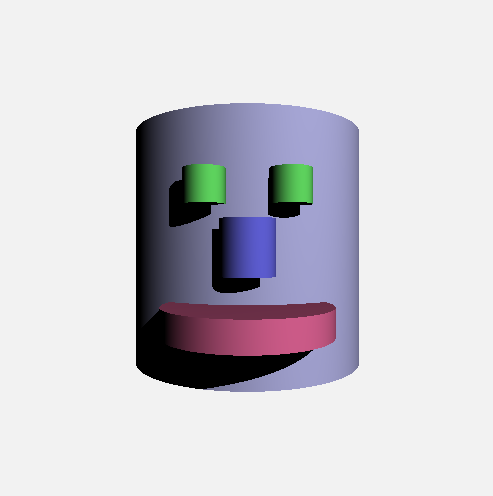

# Ray Tracer
Ray tracing renderer. Capabilities include:
- Reflections
- Sphere Rendering
- Cylinder Rendering
- Specular Shading
- Ambient Shading
- Diffuse Shading

Reflections implemented using recursive eye ray generation.

## Sample Scenes
Reflection  

Ambient Shading  

Reflection & Specular Highlights  

Specular Highlights & Ambient Shading  

Shadows  

Cylinder End Caps  

Basic Cylinders  

Ambient Shading  

## Implementation Details
1. Initialize scene
2. Recursively cast eye rays for each pixel
3. Detect ray intersection with cylinders / spheres
4. Implement shading equations